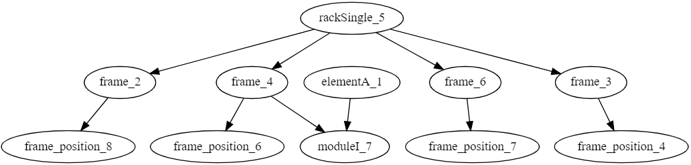

# OOASP

OOASP Object oriented Answer Set Programming

## Purpose

OOASP is a schema for describing object-oriented models with Answer Set Programming.

OOASP has been developed for research purposes to demonstrate how to describe and instantiate object-oriented models in Answer Set Programming.
The main application area is product configuration i.e. reasoning about product configuration models.

## Getting started

To run the examples we recommend to use clingo.
See [https://potassco.org/clingo/] for installation instructions.

### Racks example

The racks example is a hardware configuration toy example similar to the running example of [http://cp2016.a4cp.org/program/workshops/ws-modref-papers/Taupe.pdf]


[./examples/racks/ooasp_racks_kb.lp](./examples/racks/ooasp_racks_kb.lp) contains the knowledge base of the racks example

[./examples/racks/ooasp_racks_1elementA.lp](./examples/racks/ooasp_racks_1elementA.lp) contains a partial configuration consisting of one elementA

The two main reasoning tasks of OOASP are checking & configuring.

### Checking the configuration

The following is an example for checking a (partial) configuration:

```bash
clingo ooasp/ooasp.lp ooasp/ooasp_check.lp examples/racks/ooasp_racks_kb.lp examples/racks/ooasp_racks_1elementA.lp
```

This checks the configuration consisting of one elementA. The expected output will be something like:

```asp
ooasp_cv(i1,lowerbound1(element_modules,1)) 
ooasp_cv(i1,card_constraint1(element_modules,1))
```

i.e. indicating that an elementA requires modules.

### Configuring

The following is an example for configuring a partial configuration i.e. finding complete configurations for a given partial configuration.  

```bash
clingo ooasp/ooasp.lp ooasp/ooasp_check.lp ooasp/ooasp_config.lp examples/racks/ooasp_racks_kb.lp examples/racks/ooasp_racks_1elementA.lp
```

One possible solution is:


## Literature

OOASP: Connecting Object-Oriented and Logic Programming (2015): [Conference paper](https://doi.org/10.1007/978-3-319-23264-5_28) | [Preprint](https://arxiv.org/abs/1508.03032)
